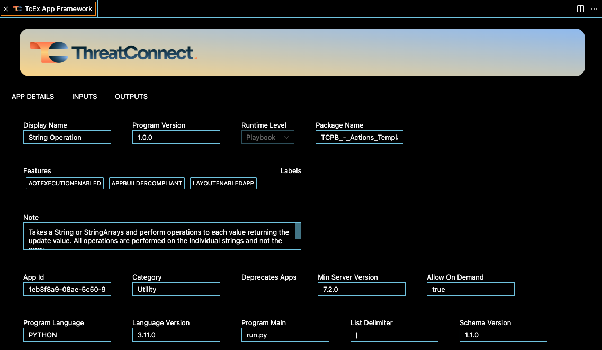

# ThreatConnect Visual Studio Code Extension

The ThreatConnect Extension for Visual Studio Code provides a comprehensive set of commands to facilitate the creation of ThreatConnect Apps within the IDE.

## Features

- Visualizations for App Details, Inputs, and Outputs
- Status Bar Controls
- Custom Palette Commands
- Schema Validation and Type Ahead
- Code Snippets

### App Details, Inputs, and Outputs Visualizations

This extension introduces a ThreatConnect icon to the Editor View. Clicking on this icon opens a panel displaying App details, inputs, and outputs. The panel updates dynamically as the App JSON configuration file is edited.

### Status Bar Controls

A new ThreatConnect icon is added to the Status Bar, enabling access to a menu with various App lifecycle commands. The App's display name and version are shown in the Status Bar, and clicking on it opens the App JSON configuration view.

### Custom Palette Commands

This extension extends the Command Palette with additional commands, streamlining the management of Apps throughout their lifecycle.

### Schema Validation and Type Ahead

The extension enhances the App JSON configuration file by introducing schema validation and type ahead functionality, guided by the App JSON schema file. This ensures accuracy and assists in error prevention while editing the configuration.

### Code Snippets

Developers can utilize the extension's provided code snippets for interacting with the ThreatConnect API. By typing `_tcs-`, the extension offers a hierarchical structure of snippets based on the functionality, covering various aspects such as Batch API, Case Management API, Metric API, Notification API, and Threat Intelligence API.

#### Snippet Prefix

-   _tcs-batch: Snippets for interacting with Batch API
-   _tcs-cm: Snippets for interacting with Case Management API
-   _tcs-metric: Snippets for interacting with Metric API
-   _tcs-notification: Snippets for interacting with Notification API
-   _tcs-ti: Snippets for interacting with Threat Intelligence API

